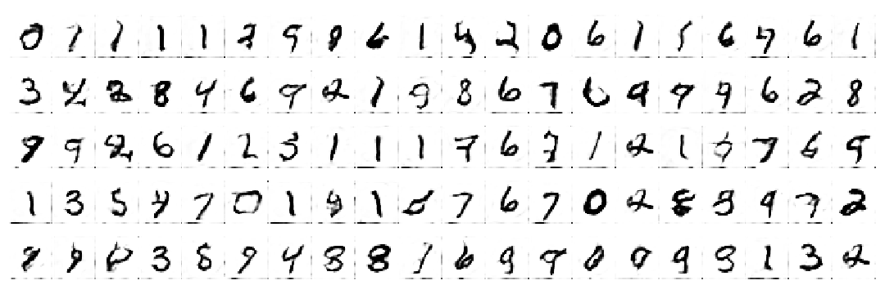

# Machine Learning projects with pytorch

Digits from a style GAN using MNIST dataset.

### Imaging

- Self-implemented Resnet on CIFAR10 ([notebook](https://github.com/amansinclair/ml/blob/master/ml/Cifar.ipynb)).
- Transfer learning for classification using a pretrained Resnet(TIMM) on Caltech101 ([notebook](https://github.com/amansinclair/ml/blob/master/ml/Caltech.ipynb)).

### Forecasting and Tabular Data

- Weekly temperature forecasts based on Melbourne daily minimum temperatures ([notebook](https://github.com/amansinclair/ml/blob/master/ml/Melbourne.ipynb)).
- Evaluation of self-implemented Tabnet on Forest Coverage Dataset (from Kaggle) ([notebook](https://github.com/amansinclair/ml/blob/master/ml/ForestCoverage.ipynb)).

### NLP

- Sentiment analysis of IMDb dataset. A comparison of a simple bag of words model against RNN ([notebook](https://github.com/amansinclair/ml/blob/master/ml/Imdb.ipynb)).
- Word Autocorrect based on words from the Sentiment140 twitter dataset. ([notebook](https://github.com/amansinclair/ml/blob/master/ml/Autocorrect.ipynb)).

### Generation

- DCGAN for digits based on MNIST Dataset. ([notebook](https://github.com/amansinclair/ml/blob/master/ml/MNIST_DCGAN.ipynb)).
- StyleGAN for digits based on MNIST Dataset.([notebook](https://github.com/amansinclair/ml/blob/master/ml/MNIST_GAN_Style.ipynb)).
